# Feastria - Fine Dining Experience

Feastria is a modern, high-end restaurant website application built with Laravel. It features a stunning, responsive design that showcases the restaurant's menu, experiences, and culinary heritage.

## 🌟 Features

- **Immersive User Interface**: A visually appealing design with high-quality imagery, glassmorphism effects, and smooth animations.
- **Comprehensive Pages**:
    - **Home**: Captivating hero section, culinary highlights, and testimonials.
    - **Menu**: Detailed menu showcasing exquisite dishes.
    - **Reservations**: Easy-to-use reservation system entry point.
    - **Experiences**: Information on private dining, wine tasting, and chef's tables.
    - **About Us**: The story and heritage behind Feastria.
    - **Contact**: Location and contact information.
    - **Gallery, Blogs, Events**: Rich content sections for user engagement.
- **Authentication**: Secure user dashboard built with Laravel Jetstream and Inertia.js.
- **Responsive Design**: Fully optimized for desktop, tablet, and mobile devices.

## 🛠️ Tech Stack

- **Backend**: Laravel 12 (PHP 8.2+)
- **Frontend (Public)**: Blade Templates, Tailwind CSS
- **Frontend (Dashboard)**: Vue.js 3, Inertia.js
- **Styling**: Tailwind CSS v3/v4
- **Database**: MySQL

## 🚀 Installation

1. **Clone the repository**

    ```bash
    git clone https://github.com/yourusername/feastria.git
    cd feastria
    ```

2. **Install Composer dependencies**

    ```bash
    composer install
    ```

3. **Install NPM dependencies**

    ```bash
    npm install
    ```

4. **Environment Setup**
   Copy the `.env.example` file to `.env` and configure your database credentials.

    ```bash
    cp .env.example .env
    ```

    Generate the application key:

    ```bash
    php artisan key:generate
    ```

5. **Database Migration**
   Run the migrations to set up the database.

    ```bash
    php artisan migrate
    ```

6. **Build Assets**

    ```bash
    npm run build
    ```

7. **Run the Application**
   Start the Laravel development server:

    ```bash
    php artisan serve
    ```

    Start the Vite development server (for hot module replacement):

    ```bash
    npm run dev
    ```

    Visit `http://localhost:8000` in your browser.

## 📸 Screenshots

### Home Page

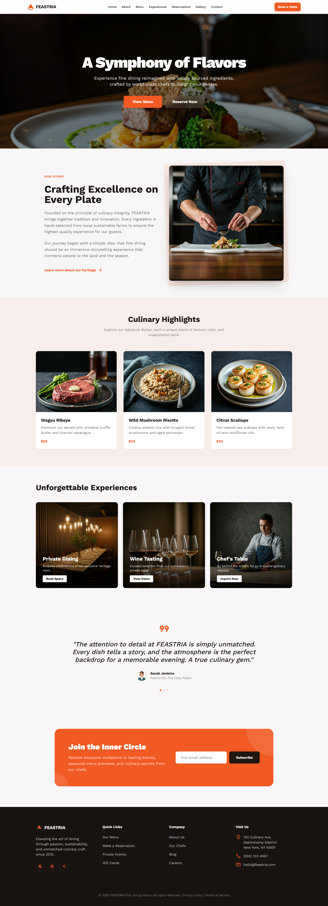

### Menu

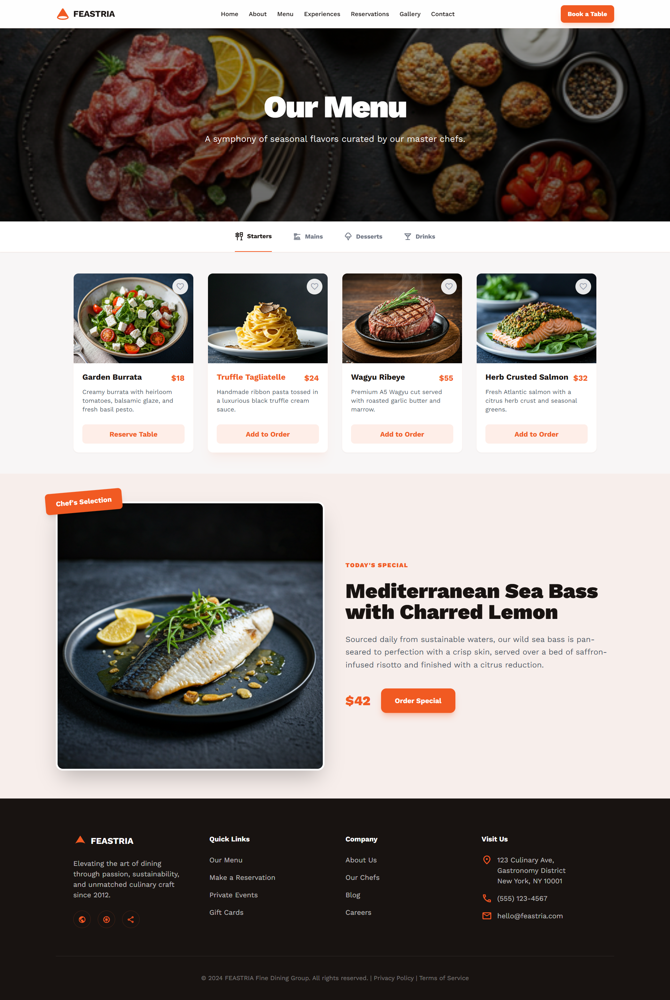

### Reservations

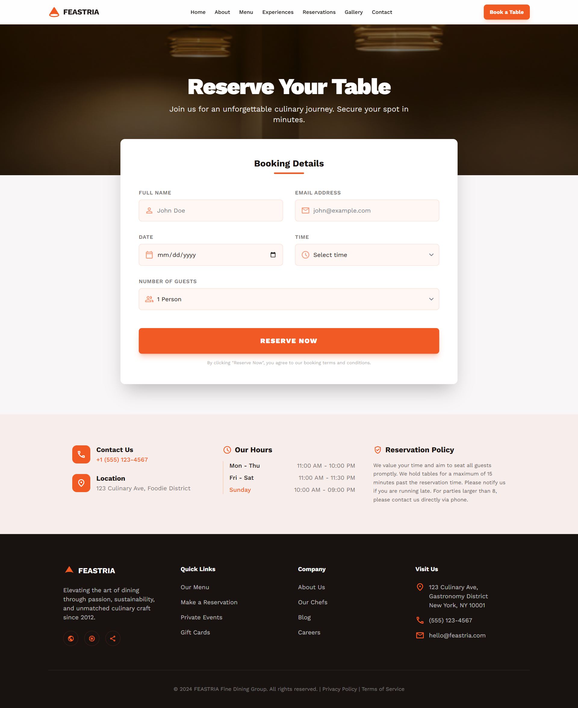

### Experiences

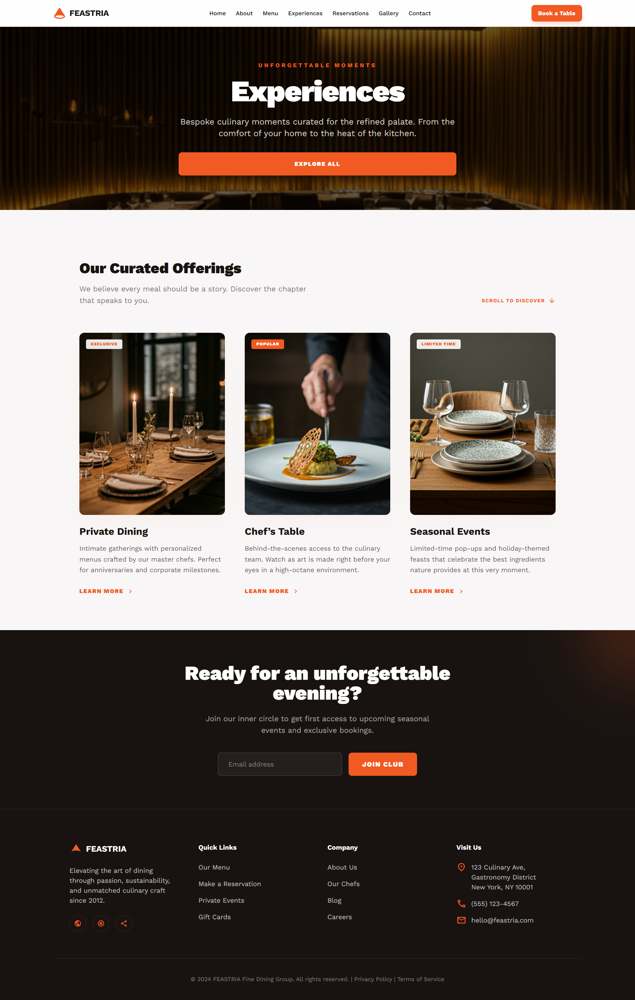

### About Us

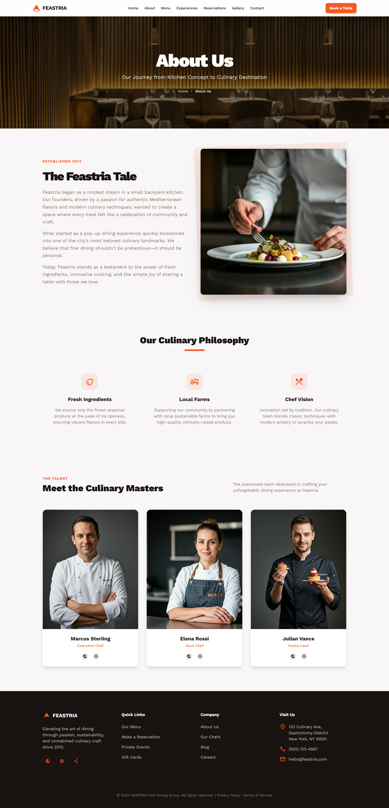

### Contact

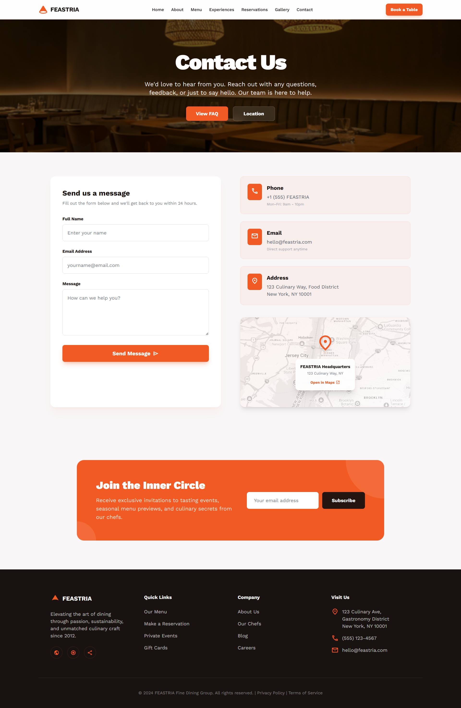

### Private Events

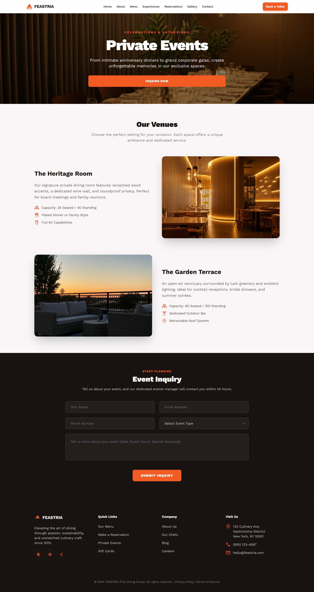

### Gallery

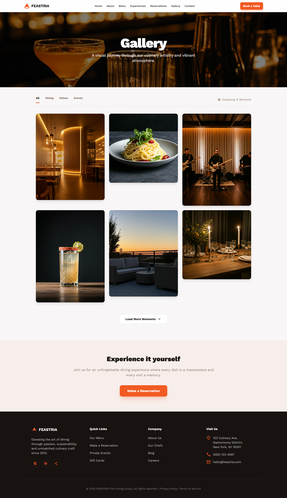

### Chefs

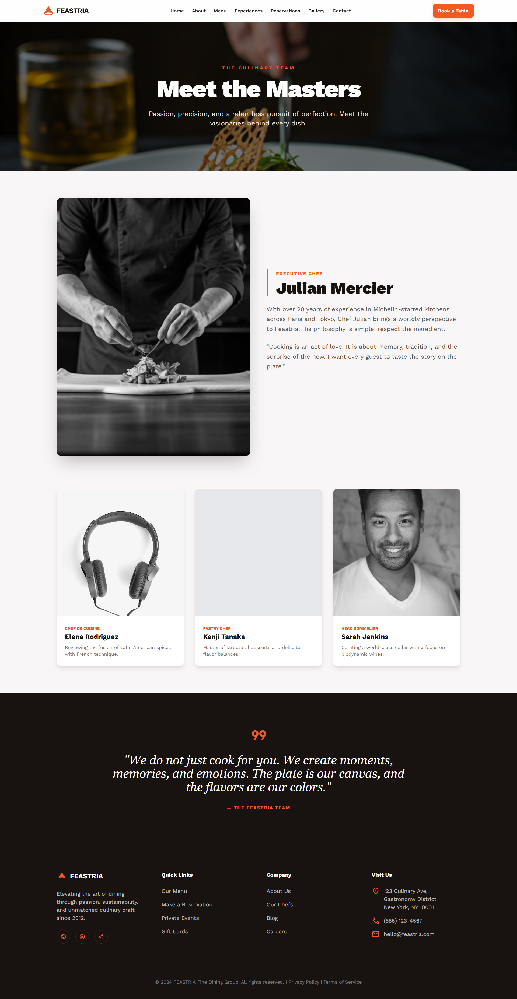

### Blogs

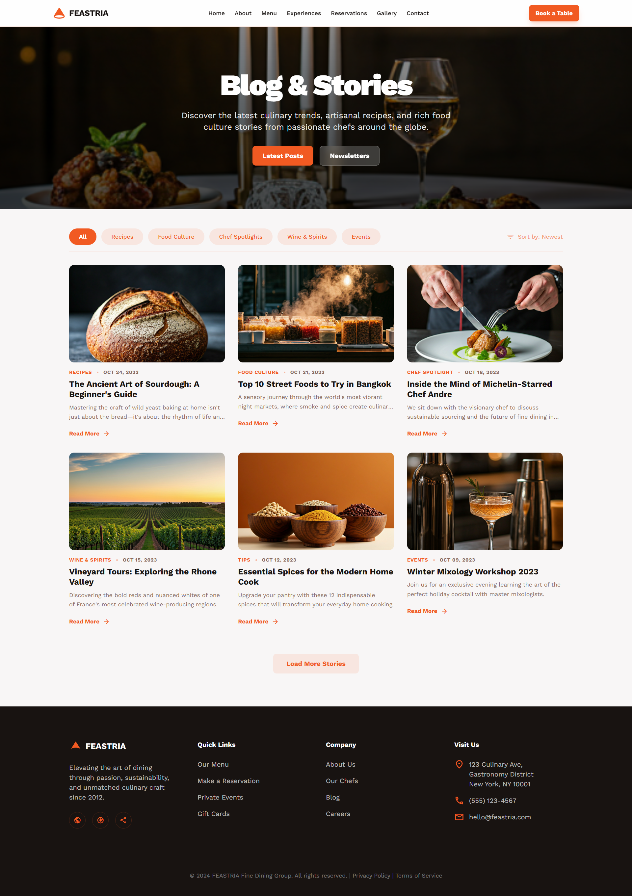

### Careers

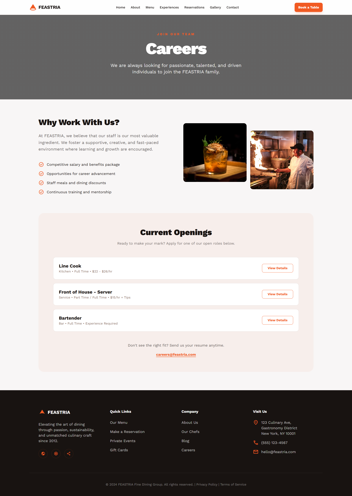

### Gift Cards

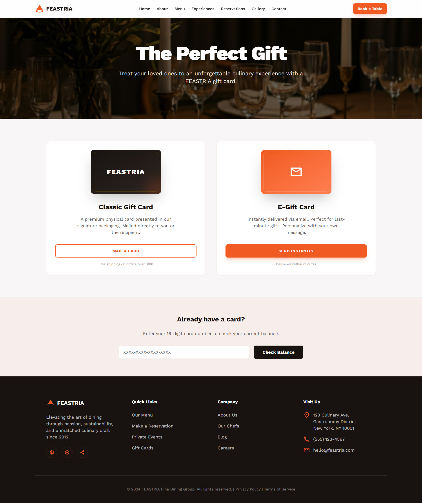

### FAQ

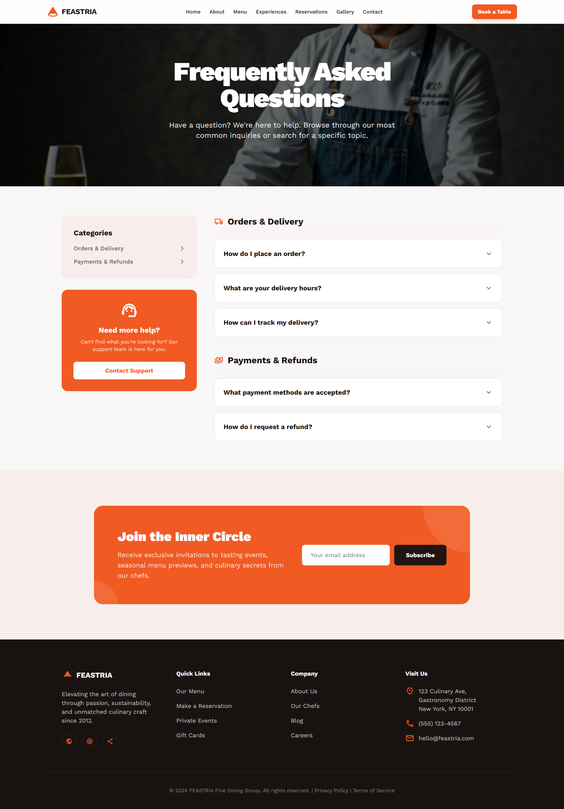

## 🤝 Contributing

Contributions are welcome! Please fork the repository and submit a pull request with your changes.

## 📄 License

This project is open-sourced software licensed under the [MIT license](https://opensource.org/licenses/MIT).
